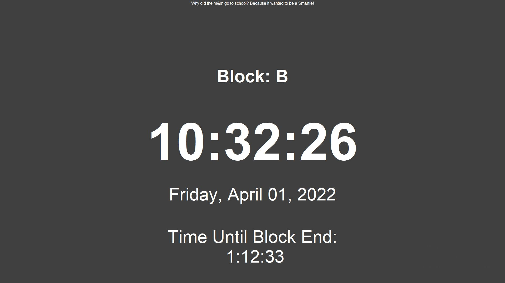

# Python-Clock

A school clock written in python with a customizable schedule.


## Installation
1. Install python [here](https://www.python.org/downloads/). Make sure it is added to your PATH environment variable. Otherwise, you won't be able to run python commands from the terminal like this: `python script.py`.
1. Navigate to project folder using `cd projects` in git bash on windows or terminal on linux
2. Run `git clone https://github.com/Enprogames/python-clock.git`
3. Move into project directory: `cd python-clock`
4. Run setup.sh script: `./setup.sh`. If this is not desired, see alternative instructions below. This does the following:
    - Creates and activates a virtual environment with venv
    - Upgrades pip to latest version and installs all packages from requirements.txt
    - Installs pre-commit hooks as specified in .pre-commit-config.yaml
    - Creates .env file for django secret key. You must copy your django secret key into this file.
    - Creates post-merge hook which will do the following everytime a merge is done:
        - Activate virtual environment
        - Update pip and install any new packages from requirements.txt
    - Create update.sh script which can be used to run post-merge hook manually.
- Alternatively, to setup the project manually and avoid running the setup.sh script, run the following (if using windows, make sure to run windows instructions inside of git bash).
    1. Create python virtual environment using venv
        - On linux: `python3 -m venv venv --prompt python-clock`
        - On windows: `python -m venv venv --prompt python-clock`
    2. Activate virtual environment
        - On linux: `source venv/bin/activate`
        - On windows: `source venv/Scripts/activate`
    3. Update python package manager (PIP) to latest version
        - `python -m pip install --upgrade pip`
    4. Install all required packages from requirements.txt
        - `python -m pip install -r requirements.txt`
    5. Setup pre-commit hooks (optional if not contributing to project). This stops you from committing files which are improperly formatted.
        - `python -m pre_commit install`
    6. Make sure tkinter is installed, as this is the GUI library used. On linux, run `sudo apt-get install python3-tk`.

## Usage
1. Run the `main.pyw` file from the root of the project.
    1. On linux: `src/main.pyw`
    2. On windows: 'python3 src/main.pyw`

## Creating Custom Schedules

Coming soon...

## Future 

- [ ] Create better schedules using JSON instead of CSV files
    ```
    {
        "Default Schedule": {
            "default": "Break", // Leave blank for no text to show up between events
            "events": {
                "Before School": ["0:00", "8:55"],
                "A Block": ["8:55", "10:20"],
                "B Block": ["10:30", "11:45"],
                "C Block": [],
                "D Block": [],
                "School Over": []
            }
        }
    }
    ```

- [ ] Create admin dashboard
    - [ ] CRUDL menu for schedule
    - [ ] Fully customizable color scheme

- [ ] Transition to using eel instead of tkinter

## License

Copyright 2022 Ethan Posner

Licensed under the Apache License, Version 2.0 (the "License");
you may not use this file except in compliance with the License.
You may obtain a copy of the License at

    http://www.apache.org/licenses/LICENSE-2.0

Unless required by applicable law or agreed to in writing, software
distributed under the License is distributed on an "AS IS" BASIS,
WITHOUT WARRANTIES OR CONDITIONS OF ANY KIND, either express or implied.
See the License for the specific language governing permissions and
limitations under the License.
